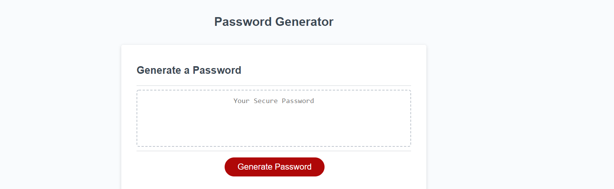
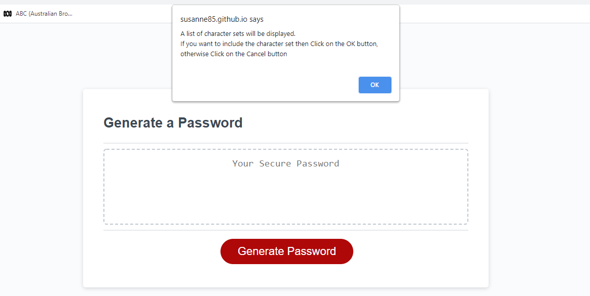
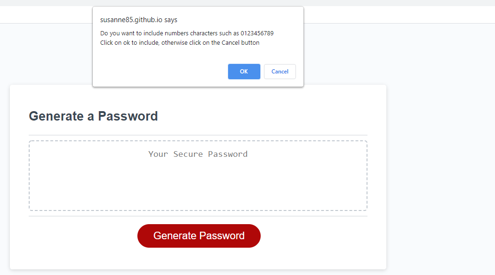
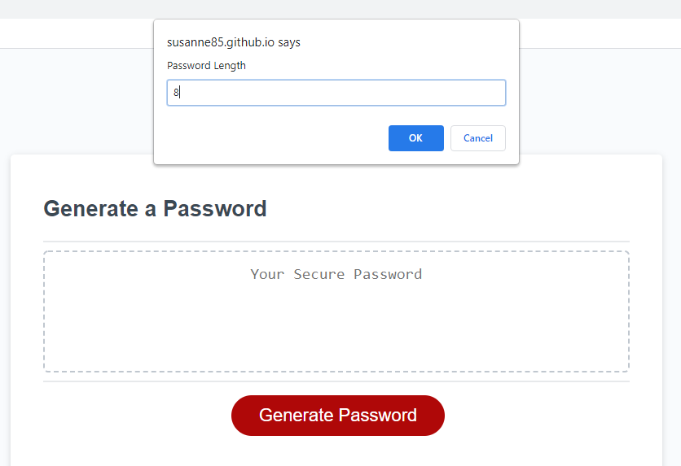

GeneratePassword
This module generates a random password based on selection criteria entered by a user.

The user is able to chose a number of character sets to include and a password length between 8 and 128. 
One of the selection criteria is to ensure that at least one character from each character set is included in the password that is generated.
However this criteria actually leads to a less random password that is generated, than if all of the characters from each character set
are strung together in one string and the random password then generated on that string.

**Link**

The link to the deployed application is : https://susanne85.github.io/generatepassword/

The following screen shots show the display of confirm boxes in which the user either clicks on the ok button to include the character set or
cancel to exclude the character set from the random password generation.

Initial page display

Instructions to user as to how to include or exclude character sets.

Display for including numbers in the generated password.

Display for entering the length of the generated password.

The final display of generated password based on the character sets which the user included and the length of password required.
The generated password is displayed in quotes so that it is more readable.

